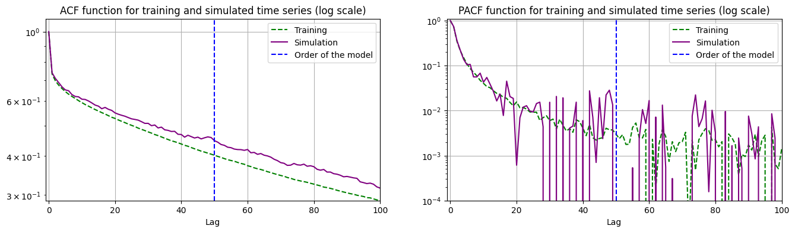

<h1 align="center">

</h1><br>

<p align="center">

[](https://pypi.org/project/tradeflow/)
[](https://pypi.org/project/tradeflow/)
[](https://github.com/MartinGangand/tradeflow/actions/workflows/ci.yml?query=branch%3Amain)
[](https://codecov.io/github/MartinGangand/tradeflow)

</p>

tradeflow is a library that allows you to generate autocorrelated time series of signs.

## Usage
Fit an autoregressive model with a time series of signs (e.g, [1, 1, -1, -1, 1, -1, 1, 1, 1, 1, ...]).

```python
from tradeflow import AR

ar_model = AR(signs=signs, max_order=50, order_selection_method='pacf')
ar_model.fit(method="yule_walker", significance_level=.05, check_stationarity=True, check_residuals=True)  # Fit autoregressive model
```

Simulate an autocorrelated time series of signs:
```python
signs_simulation = ar_model.simulate(size=10_000)  # Simulate autocorrelated time series of signs
print(signs_simulation[:10])
# [-1, -1, 1, 1, 1, 1, 1, -1, 1, 1]
```

Compare the main statistics (count, percentage of buy signs) of the original signs and the simulated ones.
It also computes the mean and percentiles of the series counting the number of consecutive signs.
```python
ar_model.simulation_summary(percentiles=[50, 95, 99])
```

|                            |   Training |   Simulation |
|:---------------------------|-----------:|-------------:|
| size                       |  995093    |     10000    |
| pct_buy (%)                |      42.32 |        52.57 |
| mean_nb_consecutive_values |       7.64 |         7.66 |
| std_nb_consecutive_values  |      32.34 |        18.47 |
| Q50_nb_consecutive_values  |       2    |         2    |
| Q95_nb_consecutive_values  |      34    |        34    |
| Q99_nb_consecutive_values  |      95    |        99    |


## Installation
tradeflow is available on PyPI:

```bash
pip install tradeflow
```

## Background
Autocorrelated time series are sequences where each value is statistically dependent on previous values.

The signs of arriving market orders have long-range autocorrelations(WHERE).

This package is inspired by the book "Trades, Quotes and Prices: Financial Markets Under the Microscope" by Bouchaud et al. [[1, Chapter 10 and 13]](#1), which discusses the highly persistent nature of the sequence of binary variables $\epsilon_t$ that describe the direction of market orders.
That is, buy orders ($\epsilon_t = +1$) tend to follow other buy orders, and sell orders ($\epsilon_t = -1$) tend to follow other sell orders, often for very long periods.

Empirical studies show that the autocorrelation function of market-order signs decays extremely slowly with the number of lags.

Assuming that time series of signs $\epsilon_t$ is well modelled by a discrete autoregressive process, the best predictor of the next sign, just before it happens, is a linear combination of the past signs:
$$\hat{\epsilon_t} = \sum_{k=1}^{p} \mathbb{K}(k) \epsilon_{t-k}$$
where $\mathbb{K}(k)$ can be inferred from the sign autocorrelation function using the Yule–Walker equation and ${p}>0$ is the order of the model (number of lags to include in the model), $\forall \ell > p, \mathbb{K}(\ell) = 0$.

Thus, the probability that the next sign is $\epsilon_t$ is then given by
$$\mathbb{P}_{t-1}(\epsilon_t) = \frac{1+\epsilon_t \hat{\epsilon_t}}{2}$$

## Background base
Study the highly persistent nature of the sequence of binary variables $\epsilon_t$ that describe the direction of market orders.
Buy orders tend to follow other buy orders and sell orders tend to follow other sell orders, both for very long periods of time.
empirical studies show that market-order sign autocorrelation function decays extremely slowly with the number of lags.
Market order signs are positively autocorrelated, it came as a surprise that these autocorrelations decay extremely slowly.
This is a consequence of the persistence of order flow: although on average there are an equal number of buy and sell market orders, in any finite window there is likely to be an accumulation of one or the other.

(p194) The conditional expectation of εt, given the past history of signs is. 
$$\hat{\epsilon_t} = (2p - 1) \sum_{\ell=1}^{\infty}\mathbb{K}(\ell)\epsilon_{t-\ell}$$
Therefore, the best predictor of the next sign in a DAR processes is a linear combination of the past signs

Explain the possible causes?? NO but document it to know and in the readme say that reasons are in the book (herding and order splitting) (2 parts about it: p193 and p197)

The signs of arriving market orders have long-range autocorrelations. This makes the signs of future market orders predictable, which seems to be at odds with the (nearly) uncorrelated nature of price returns.


(p260)
In a discrete autoregressive process, the best predictor $\hat{\epsilon_t}=\mathbb{E}_{t-1}[\epsilon_t]$ of the next trade sign, just before it happens, can be written as 
$$\hat{\epsilon_t} = \sum_{k=1}^{p} \mathbb{K}(k) \epsilon_{t-k}$$.
The backward-looking kernel $\mathbb{K}(k)$ can be inferred from the sign autocorrelation function using the Yule–Walker equation.
${p}>0$ is the order of the model (number of lags to include in the model), $\forall \ell > p, \mathbb{K}(\ell) = 0$

The probability that the next sign is $\epsilon_t$ is then given by
$$\mathbb{P}_{t-1}(\epsilon_t) = \frac{1+\epsilon_t \hat{\epsilon_t}}{2}$$

## Features
- Fit AR models to binary sign time series
- Automatic order selection (number of lags to include in the model)
- Simulation of autocorrelated sign sequences
- Statistical summary and visualization tools
- Stationarity and residual autocorrelation checks

## Test image
|    | animal_1   | animal_2   |
|---:|:-----------|:-----------|
|  0 | elk        | dog        |
|  1 | pig        | quetzal    |
<picture align="center">
  <source media="(prefers-color-scheme: dark)" srcset="https://pandas.pydata.org/static/img/pandas_white.svg">
  
</picture>


## Test ref
"...the **go to** statement should be abolished..." [[1]](#1).

* [feature] Add an awesome feature ([#33])
* [bug] Finally fixed this stupid bug ([#19])

[#19]: https://github.com/user/repo/issues/19
[#33]: https://github.com/user/repo/issues/33

## References
<a id="1">[1]</a> 
Bouchaud J-P, Bonart J, Donier J, Gould M. Trades, Quotes and Prices: Financial Markets Under the Microscope. Cambridge University Press; 2018.

J.-P. Bouchaud, J. Bonart, J. Donier, M. Gould, Trades, quotes and prices: financial markets under the microscope, Cambridge University Press, 2018.
Jean-Philippe Bouchaud, Julius Bonart, Jonathan Donier, and Martin Gould. Trades, quotes and prices: financial markets under the microscope. Cambridge University Press, 2018.
Jean-Philippe Bouchaud, Julius Bonart, Jonathan Donier, and Martin Gould. Trades, quotes and prices: financial markets under the microscope. Cambridge University Press, Cambridge, 2018.
J.-P. Bouchaud, J. Bonart, J. Donier, and M. Gould, Trades, Quotes and Prices: Financial Markets Under the Microscope. Cambridge University Press, 2018.
Jean-Philippe Bouchaud, Julius Bonart, Jonathan Donier, and Martin Gould. Trades, quotes and prices: financial markets under the microscope. Cambridge University Press, 2018.
Bouchaud, J. P., Bonart, J., Donier, J., & Gould, M. (2018). Trades, quotes and prices: financial markets under the microscope. Cambridge University Press.

in Bouchaud et al. [20, Chapter 13]
to the book by Bouchaud et al. [11] f

## Documentation

Read the full documentation [here](https://martingangand.github.io/tradeflow/).
